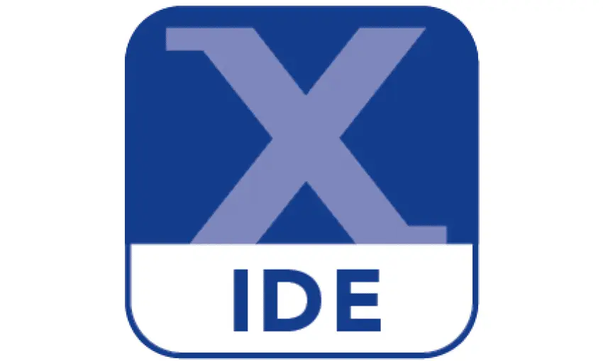

<body style="background-color: white; font-family: Arial, sans-serif; color: black;">

<h1 align="center">Hi 👋, I'm Giang Trinh</h1>

## About me:
*I'm an embedded systems enthusiast with a solid foundation in C/C++, some knowledge of Python, and circuit design. I enjoy developing low-level firmware and working with real-time systems.*

## Contact with me:

- 📧 Email  : [giangtrinhvnbl2k2@gmail.com](mailto:giangtrinhvnbl2k2@gmail.com)
- 💼 Linkedin : [giang-trinh-huu](https://www.linkedin.com/in/giang-trinh-huu)

## Languages and Tools:

### 1. Programming Languages:
- C, C++, Python, Bash, SQLite  
- 

    
    
    
    
    
  

### 2. Operating Systems:
- Linux, FreeRTOS  
- 

    
    
  

### 3. Tools for Simulation and Design:
- Altium, KiCad, Proteus, LTSpice, MATLAB, Qt Creator
- 

    
    
    
    
    
    
  

### 4. Code Editors & IDEs:
- VS Code, ESP-IDF, Arduino IDE, MCUXpresso, Keil uVision, Atmel Studio
- 

    
    
    
    
    
    
  

<!--
**TrinhHuuGiang/TrinhHuuGiang** is a ✨ _special_ ✨ repository because its `README.md` (this file) appears on your GitHub profile.

Here are some ideas to get you started:

- 🔭 I’m currently working on ...
- 🌱 I’m currently learning ...
- 👯 I’m looking to collaborate on ...
- 🤔 I’m looking for help with ...
- 💬 Ask me about ...
- 📫 How to reach me: ...
- 😄 Pronouns: ...
- ⚡ Fun fact: ...
-->

</body>
